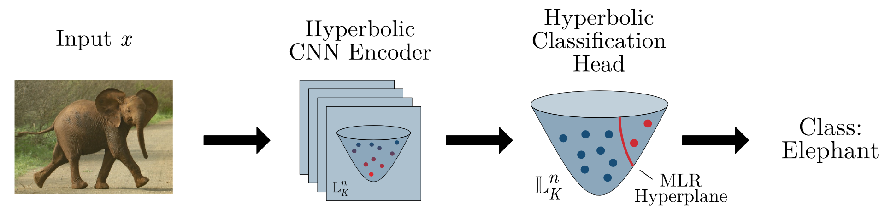

# Hyperbolic Computer Vision - ICLR 2024

Official PyTorch implementation of the ICLR 2024 paper [Fully Hyperbolic Convolutional Neural Networks for Computer Vision](https://openreview.net/forum?id=ekz1hN5QNh).

By [Ahmad Bdeir](https://scholar.google.com/citations?user=eeeO7kEAAAAJ), [Kristian Schwethelm](https://scholar.google.com/citations?user=Q5X7Kw8AAAAJ), [Niels Landwehr](https://scholar.google.com/citations?user=k6Ei14sAAAAJ)

<p align="center">

</p>

## Introduction

**TL; DR.** In this work, we propose HCNN, a generalization of the convolutional neural network that learns latent feature representations in hyperbolic spaces in every layer, fully leveraging the benefits of hyperbolic geometry. This leads to better image representations and performance.

**Abstract.** Real-world visual data exhibit intrinsic hierarchical structures that can be represented effectively in hyperbolic spaces. Hyperbolic neural networks (HNNs) are a promising approach for learning feature representations in such spaces. However, current HNNs in computer vision rely on Euclidean backbones and only project features to the hyperbolic space in the task heads, limiting their ability to fully leverage the benefits of hyperbolic geometry. To address this, we present HCNN, a fully hyperbolic convolutional neural network (CNN) designed for computer vision tasks. Based on the Lorentz model, we generalize fundamental components of CNNs and propose novel formulations of the convolutional layer, batch normalization, and multinomial logistic regression. Experiments on standard vision tasks demonstrate the promising performance of our HCNN framework in both hybrid and fully hyperbolic settings. Overall, we believe our contributions provide a foundation for developing more powerful HNNs that can better represent complex structures found in image data.

**This repository.** In this repository, we provide implementations of the main experiments from our paper. Additionally, we set up a [library](code/lib) with many network components for HNNs in the Lorentz model. The following components are included:

Lorentz model:
- [[file link]](code/lib/lorentz/blocks/resnet_blocks.py) Our ResNet blocks 
- [[file link]](code/lib/lorentz/layers/LConv.py) Our 1D and 2D (transposed) convolutional layers
- [[file link]](code/lib/lorentz/layers/LBnorm.py) Our 1D and 2D batch normalizations
- [[file link]](code/lib/lorentz/layers/LMLR.py) Our multinomial logistic regression (MLR) classifier
- [[file link]](code/lib/lorentz/layers/LModules.py) Our non-linear activation and global average pooling
- [[file link]](code/lib/lorentz/layers/LFC.py) Modified fully-connected layer of [Chen et al. (2022)](https://github.com/chenweize1998/fully-hyperbolic-nn) 
- [[file link]](code/lib/lorentz/distributions/wrapped_normal.py) Modified wrapped normal distribution of [Nagano et al. (2019)](https://github.com/pfnet-research/hyperbolic_wrapped_distribution) 
- [[file link]](code/lib/lorentz/manifold.py) Extension of [Geoopt's](https://github.com/geoopt/geoopt) Lorentz manifold with new methods like flattening/reshaping, centroid, etc.

Poincaré ball:
- [[file link]](code/lib/poincare/layers/PMLR.py) MLR of [Shimizu et al. (2019)](https://github.com/mil-tokyo/hyperbolic_nn_plusplus) 
- [[file link]](code/lib/poincare/distributions/wrapped_normal.py) Wrapped normal distribution of [Mathieu et al. (2019)](https://github.com/emilemathieu/pvae) 

Additional features:
- [[file link]](code/lib/utils/visualize.py) Visualization in Lorentz model and Poincaré ball using [Umap](https://github.com/lmcinnes/umap) 

**Note.** The curvature K of the Lorentz model is defined differently in our paper and in Geoopt -> geoopt.K = -1/K.

## License

This code is released under the [MIT License](LICENSE).

## Citing our work

If you find our work useful for your research, please cite our paper as follows:

```bibtex
@inproceedings{Bdeir2024,
     title={Fully Hyperbolic Convolutional Neural Networks for Computer Vision},
     author={Ahmad Bdeir and Kristian Schwethelm and Niels Landwehr},
     booktitle={The Twelfth International Conference on Learning Representations},
     year={2024},
     url={https://openreview.net/forum?id=ekz1hN5QNh}
}
```

## Main results

In this section, we provide our experimental results and configuration files for reproduction.

### Classification

In this experiment, we evaluate the performance of HNNs on standard image classification tasks using ResNet-18 and three benchmark datasets: CIFAR-10, CIFAR-100, and Tiny-ImageNet. For this, we employ the training procedure of [DeVries and Taylor (2017)](https://arxiv.org/abs/1708.04552).

Table 1: Main results (Accuracy (%), estimated average and standard deviation from 5 runs).

| **Model**         |   **CIFAR-10**   |   **CIFAR-100**  | **Tiny-ImageNet** |              **Links**             |
|-----------------|:------------:|:------------:|:-------------:|:--------------------------------:|
| Euclidean   | 95.14 ± 0.12 | 77.72 ± 0.15 |  65.19 ± 0.12 | [config](code/classification/config/E-ResNet18.txt) |
| Hybrid Poincaré  | 95.04 ± 0.13 | 77.19 ± 0.50 |  64.93 ± 0.38 | [config](code/classification/config/EP-ResNet18.txt) |
| Hybrid Lorentz (Ours)  | 94.98 ± 0.12 | 78.03 ± 0.21 |  65.63 ± 0.10 | [config](code/classification/config/EL-ResNet18.txt) |
| HCNN Lorentz (Ours) | **95.14 ± 0.08** | **78.07 ± 0.17** |  **65.71 ± 0.13**   | [config](code/classification/config/L-ResNet18.txt)|

### Image generation

In this experiment, we evaluate the performance of HNNs on image generation tasks using vanilla VAEs and three benchmark datasets: CIFAR-10, CIFAR-100, and CelebA.

Table 2: Main results (FID, estimated average and standard deviation from 5 runs).

|                           | **CIFAR-10** | **CIFAR-10** | **CIFAR-100** | **CIFAR-100** | **CelebA** | **CelebA** |                                  |
|---------------------------|:------------:|:------------:|:-------------:|:-------------:|:-------------:|:-------------:|:-------------:|
| **Model**                 | **Rec. FID** | **Gen. FID** |  **Rec. FID** | **Gen. FID**  | **Rec. FID** | **Gen. FID** |             **Links**            |
|     Euclidean    |   61.21 ± 0.72  |   92.40 ± 0.80  |  63.81 ± 0.47   |  103.54 ± 0.84   |  54.80 ± 0.29   |  79.25 ± 0.89  | [config](code/generation/config/E-VAE) |
| Hybrid Poincaré |   59.85 ± 0.50 |   90.13 ± 0.77   |  62.64 ± 0.43    |  **98.19 ± 0.57**    |  54.62 ± 0.61   |  81.30 ± 0.56     | [config](code/generation/config/EP-VAE) |
| Hybrid Lorentz  |   59.29 ± 0.47   |  90.91 ± 0.84   |  62.14 ± 0.35  |  98.34 ± 0.62  |  54.64 ±  0.34   |  82.78 ± 0.93   | [config](code/generation/config/EL-VAE) |
| HCNN Lorentz (Ours)           |  **57.78 ± 0.56**  |  **89.20 ± 0.85**    |  **61.44 ± 0.64**    |   100.27 ± 0.84  |    **54.17 ± 0.66**   |  **78.11 ± 0.95**    | [config](code/generation/config/L-VAE) |

## Installation

### Requirements

- Python>=3.8

   We recommend using [Anaconda](https://docs.conda.io/projects/continuumio-conda/en/latest/user-guide/install/index.html):

   ```bash
   conda create -n HCNN python=3.8 pip 
   conda activate HCNN
   ```

- PyTorch, torchvision

   Get the correct command from [here](https://pytorch.org/get-started/locally/). For example, for Linux systems with CUDA version 11.7:
   ```bash
   conda install pytorch torchvision pytorch-cuda=11.7 -c pytorch -c nvidia
   ```

- Additional requirements:
   ```bash
   pip install -r requirements.txt
   ```

## Usage

### Dataset preparation

We employ CIFAR-10/100 and CelebA implementations from torchvision. Tiny-ImageNet must be downloaded from [here](http://cs231n.stanford.edu/tiny-imagenet-200.zip) and organized as follows
```
HyperbolicCV/
└── code/
    └── classification/
        └── data/
            └── tiny-imagenet-200/
                └── train/
                    └── images/
                        └── n01443537/
                            └── n01443537_0.JPEG
                            └── ...
                        └── ...
                └── val/
                    └── images/
                        └── n01443537/
                            └── val_68.JPEG
                            └── ...
                        └── ...
                    └── val_annotations.txt
```

You can follow the following steps to download and organize the Tiny-ImageNet dataset automatically.

1. Download dataset
    ```bash
    cd code/classification
    bash get_tinyimagenet.sh
    ```

2. Organize dataset
    ```bash
    cd code/classification
    python org_tinyimagenet.py
    ```

### Training

- For **classification**, choose a [config file](code/classification/config) and adapt the following command.

   ```bash
   python code/classification/train.py -c classification/config/L-ResNet18.txt
   ```

   You can also add additional arguments without changing the config file. For example:

   ```bash
   python code/classification/train.py -c classification/config/L-ResNet18.txt\
      --output_dir classification/output --device cuda:1 --dataset CIFAR-10
   ```

- For **generation**, choose a [config file](code/generation/config) and adapt the following command.

   ```bash
   python code/generation/train.py -c generation/config/L-VAE/L-VAE-CIFAR.txt
   ```

   You can also add additional arguments without changing the config file. For example:

   ```bash
   python code/generation/train.py -c generation/config/L-VAE/L-VAE-CIFAR.txt\
      --output_dir generation/output --device cuda:1 --dataset CIFAR-100
   ```

### Evaluation

- For **classification**, we provide a test script with the following options.

   - Test accuracy of a model. For example:

      ```bash
      python code/classification/test.py -c classification/config/L-ResNet18.txt\
        --mode test_accuracy --load_checkpoint PATH/TO/WEIGHTS.pth
      ```
   - Visualize embeddings of a model. For example:

      ```bash
      python code/classification/test.py -c classification/config/L-ResNet18.txt\
        --mode visualize_embeddings --load_checkpoint PATH/TO/WEIGHTS.pth --output_dir classification/output
      ```

   - Adversarial attacks (FGSM and PGD). For example:

      ```bash
      python code/classification/test.py -c classification/config/L-ResNet18.txt\
        --mode fgsm --load_checkpoint PATH/TO/WEIGHTS.pth
      ```
      ```bash
      python code/classification/test.py -c classification/config/L-ResNet18.txt\
        --mode pgd --load_checkpoint PATH/TO/WEIGHTS.pth
      ```

- For **generation**, we provide a similar test script with the following options.
   - Test FID of a model. For example:
      ```bash
      python code/generation/test.py -c generation/config/L-VAE/L-VAE-CIFAR.txt\
        --mode test_FID --load_checkpoint PATH/TO/WEIGHTS.pth
      ```
   - Visualize latent embeddings of a model. For example:

      ```bash
      python code/generation/test.py -c generation/config/L-VAE/L-VAE-MNIST.txt\
        --mode visualize_embeddings --load_checkpoint PATH/TO/WEIGHTS.pth --output_dir generation/output
      ```
   - Visualize sample generations/reconstructions of a model. For example:

      ```bash
      python code/generation/test.py -c generation/config/L-VAE/L-VAE-CIFAR.txt\
        --mode generate --load_checkpoint PATH/TO/WEIGHTS.pth --output_dir generation/output
      ```
      ```bash
      python code/generation/test.py -c generation/config/L-VAE/L-VAE-CIFAR.txt\
        --mode reconstruct --load_checkpoint PATH/TO/WEIGHTS.pth --output_dir generation/output
      ```
